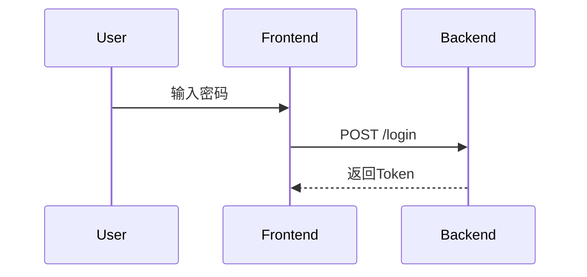

# Flotilla云端代码托管平台 - UML课程答辩清单

---

## 一、UML答辩四人分工

| 成员 | 答辩角色 | 负责的UML图 | 需要掌握的知识点 |
|------|----------|-------------|------------------|
| **成员A** | 架构建模 | 组件图、部署图、架构图（9张） | 系统架构、Kubernetes部署、微服务通信、数据库架构 |
| **成员B** | 行为建模 | 时序图、活动图（12张） | 用户认证流程、Git操作流程、Raft选举、消息交互 |
| **成员C** | 静态建模 | 类图、ER图（5张） | 类之间关系、数据库设计、Raft类结构、服务层设计 |
| **成员D** | 需求建模 | 用例图、状态图（8张） | 用户角色、功能需求、状态转换、生命周期管理 |

---

## 二、每人负责的具体图表

### 成员A - 架构建模（9张图）

| 图号 | 图名 | 要点 |
|------|------|------|
| 图2-1 | 系统整体架构图 | 前后端分离、三层架构、基础设施层 |
| 图2-13 | 系统组件部署图 | NestJS模块划分、组件依赖关系 |
| 图2-21 | 后端模块依赖图 | 32个模块的依赖关系 |
| 图2-25 | Kubernetes部署架构图 | Pod、Service、Ingress配置 |
| 图2-27 | RBAC三层权限模型图 | 平台→组织→项目三层权限 |
| 图2-28 | 数据库读写分离架构图 | 主从复制、读写分离策略 |
| 图2-29 | GitFlow分支管理策略图 | main/develop/feature分支 |
| 图2-30 | 微服务通信架构图 | 服务间调用、消息队列 |
| 图2-26 | 前端React组件层级图 | 组件树、状态管理 |

**准备回答的问题：**

1. 系统为什么采用前后端分离架构？
2. Kubernetes部署有什么优势？
3. 为什么需要读写分离？
4. RBAC权限模型如何设计？

---

### 成员B - 行为建模（12张图）

| 图号 | 图名 | 要点 |
|------|------|------|
| 图2-2 | 用户认证时序图 | 登录流程、JWT生成、Session存储 |
| 图2-3 | Git Push流程图 | pack解析、Raft提交、对象存储 |
| 图2-11 | Raft Leader选举时序图 | RequestVote、投票统计、成为Leader |
| 图2-15 | 用户注册时序图 | 邮箱验证、密码加密 |
| 图2-16 | OAuth第三方登录时序图 | GitHub/Google授权流程 |
| 图2-17 | Git Clone操作时序图 | info/refs、upload-pack |
| 图2-24 | WebSocket实时通知时序图 | 连接建立、消息推送 |
| 图2-33 | API请求生命周期时序图 | 中间件、Guard、拦截器 |
| 图2-34 | Raft日志复制详细时序图 | AppendEntries、日志提交 |
| 图2-12 | Pull Request工作流活动图 | 创建→审查→合并流程 |
| 图2-18 | 通知系统活动图 | 事件触发、渠道分发 |
| 图2-22 | 安全认证流程活动图 | 多因素认证流程 |

**准备回答的问题：**
1. 时序图中的同步消息和异步消息有什么区别？
2. Raft Leader选举的具体过程是什么？
3. OAuth授权流程有哪些步骤？
4. 活动图中的分支和并行有什么区别？

---

### 成员C - 静态建模（5张图）

| 图号 | 图名 | 要点 |
|------|------|------|
| 图2-7 | 核心实体类图 | User、Project、Repository、Issue、PR |
| 图2-8 | 数据库ER图 | 48个模型、主外键关系 |
| 图2-9 | Raft共识类图 | RaftNode、Transport、StateMachine |
| 图2-19 | 服务层类图 | Service类、依赖注入 |
| 图2-20 | 数据访问层类图 | Repository模式、Prisma |

**准备回答的问题：**
1. 类图中关联、聚合、组合的区别？
2. 你们的核心实体有哪些？关系是什么？
3. Raft类图中各个类的职责是什么？
4. 为什么使用Repository模式？

---

### 成员D - 需求建模（8张图）

| 图号 | 图名 | 要点 |
|------|------|------|
| 图2-4 | 整体用例图 | 6种角色、20个核心用例 |
| 图2-5 | 认证模块用例图 | 登录、注册、OAuth、2FA |
| 图2-6 | 代码协作用例图 | Issue、PR、分支管理 |
| 图2-10 | Raft节点状态图 | Follower→Candidate→Leader |
| 图2-14 | Issue生命周期状态图 | Open→In Progress→Closed |
| 图2-23 | CI/CD流水线状态图 | Pending→Running→Success/Failed |
| 图2-31 | 用户会话管理状态图 | Active→Idle→Expired |
| 图2-32 | 文件上传处理活动图 | 分片上传、断点续传 |

**准备回答的问题：**
1. 用例图中include和extend的区别？
2. 系统有哪些用户角色？各有什么权限？
3. 状态图的初始状态和终止状态如何表示？
4. Raft节点状态转换的条件是什么？

---

## 三、UML通用问题及答案（全员必背）

### Q1: 什么是UML？有哪些主要的图？

**答案：**
UML（Unified Modeling Language，统一建模语言）是一种用于软件系统分析和设计的标准化图形建模语言。

UML 2.0包含14种图，分为两大类：

**结构图（静态）：**
- 类图（Class Diagram）
- 对象图（Object Diagram）
- 组件图（Component Diagram）
- 部署图（Deployment Diagram）
- 包图（Package Diagram）
- 组合结构图（Composite Structure Diagram）
- 轮廓图（Profile Diagram）

**行为图（动态）：**
- 用例图（Use Case Diagram）
- 活动图（Activity Diagram）
- 状态机图（State Machine Diagram）
- 时序图（Sequence Diagram）
- 通信图（Communication Diagram）
- 交互概览图（Interaction Overview Diagram）
- 时间图（Timing Diagram）

我们项目使用了6种：**用例图、类图、时序图、状态图、活动图、组件图**。

---

### Q2: 你们项目为什么选择这6种UML图？

**答案：**

| UML图 | 选择原因 | 在项目中的应用 |
|-------|----------|----------------|
| **用例图** | 描述功能需求，明确系统边界 | 定义6种用户角色和20+功能 |
| **类图** | 描述静态结构，指导代码设计 | 设计48个数据模型和服务类 |
| **时序图** | 描述对象交互顺序，理清业务流程 | 描述认证、Git操作、Raft选举 |
| **状态图** | 描述对象生命周期，处理状态转换 | Raft节点、Issue、PR状态管理 |
| **活动图** | 描述业务流程，包含并行和分支 | PR工作流、通知系统、认证流程 |
| **组件图** | 描述系统架构，展示模块依赖 | 32个后端模块、微服务架构 |

---

### Q3: 类图中的关系有哪些？请举例说明。

**答案：**

| 关系 | 符号 | 含义 | 项目示例 |
|------|------|------|----------|
| **关联** | ─── | 类之间的普通关系 | User ─── Issue（用户创建Issue） |
| **聚合** | ◇─── | 整体-部分，部分可独立 | Organization ◇─── Project |
| **组合** | ◆─── | 强聚合，部分不可独立 | Repository ◆─── Branch |
| **继承** | ───▷ | 子类继承父类 | AdminUser ───▷ User |
| **实现** | ---▷ | 类实现接口 | RaftNode ---▷ StateMachine |
| **依赖** | ---> | 一个类使用另一个类 | AuthService ---> JwtService |

**代码示例：**
```typescript
// 组合关系：Repository删除时Branch也删除
class Repository {
  branches: Branch[]  // 组合
}

// 聚合关系：Organization删除时Project可转移
class Organization {
  projects: Project[]  // 聚合
}
```

---

### Q4: 用例图中的include和extend有什么区别？

**答案：**

| 关系 | 方向 | 含义 | 示例 |
|------|------|------|------|
| **include** | 基用例→被包含用例 | 基用例**必须**执行被包含用例 | "用户注册" include "发送验证邮件" |
| **extend** | 扩展用例→基用例 | 在**特定条件**下扩展基用例 | "用户登录" ←extend "两步验证"（当开启2FA时） |

**图示：**
```
include: 注册 ----include----> 发送邮件 （注册必须发邮件）
extend:  登录 <---extend----- 2FA验证  （登录可能需要2FA）
```

**项目示例：**
- 用户注册 **include** 密码强度验证、生成JWT、发送验证邮件
- 用户登录 **extend** 两步验证（当用户开启2FA时触发）

---

### Q5: 时序图的基本元素有哪些？

**答案：**

| 元素 | 符号 | 含义 |
|------|------|------|
| **生命线** | 虚线竖线 | 对象存在的时间轴 |
| **激活框** | 窄矩形 | 对象正在执行操作的时间段 |
| **同步消息** | 实线箭头 → | 发送方等待响应 |
| **异步消息** | 虚线箭头 --> | 发送方不等待响应 |
| **返回消息** | 虚线箭头 <-- | 返回结果 |
| **自调用** | 箭头指向自己 | 对象调用自己的方法 |
| **组合片段** | 框（alt/loop/par） | 条件、循环、并行 |

**项目示例（用户登录时序）：**
```
User → Frontend: 输入用户名密码
Frontend → AuthService: POST /auth/login
AuthService → Database: 查询用户
Database --> AuthService: 返回用户信息
AuthService → AuthService: 验证密码（自调用）
alt [密码正确]
    AuthService → Redis: 存储Session
    AuthService --> Frontend: 返回Token
else [密码错误]
    AuthService --> Frontend: 401错误
end
```

---

### Q6: 状态图的基本元素有哪些？Raft节点有哪些状态？

**答案：**

**状态图基本元素：**
| 元素 | 符号 | 含义 |
|------|------|------|
| **初始状态** | 实心圆 ● | 状态机的起点 |
| **终止状态** | 圆圈内实心圆 ◉ | 状态机的终点 |
| **状态** | 圆角矩形 | 对象的一种条件 |
| **转换** | 箭头 → | 状态之间的变迁 |
| **事件** | 转换上的标签 | 触发转换的条件 |
| **守卫条件** | [条件] | 转换的前提条件 |
| **动作** | /动作 | 转换时执行的操作 |

**Raft节点三种状态：**

```
        ┌──────────────┐
        │              │
   ●───→│   Follower   │←──────────────────┐
        │              │                    │
        └──────┬───────┘                    │
               │                            │
               │ 选举超时                    │ 发现更高任期
               ↓                            │
        ┌──────────────┐                    │
        │              │────────────────────┘
        │  Candidate   │
        │              │────┐
        └──────┬───────┘    │ 选举超时
               │            │ 重新选举
               │ 获得多数票  ↓
               ↓         ───┘
        ┌──────────────┐
        │              │
        │    Leader    │
        │              │
        └──────────────┘
```

---

### Q7: 活动图和流程图有什么区别？

**答案：**

| 特性 | 流程图 | 活动图 |
|------|--------|--------|
| **标准** | 无统一标准 | UML标准 |
| **并行处理** | 不支持 | 支持（分叉/汇合） |
| **泳道** | 不支持 | 支持（按角色划分） |
| **对象流** | 不支持 | 支持（数据传递） |
| **应用场景** | 简单流程 | 复杂业务流程 |

**活动图特有元素：**
- **分叉（Fork）**：一个流程分成多个并行流程
- **汇合（Join）**：多个并行流程合并
- **泳道（Swimlane）**：按角色/系统划分活动区域

**项目示例（PR工作流）：**
```
[开发者泳道]          [审查者泳道]           [CI泳道]
    │                     │                    │
 创建PR ─────────────────→│                    │
    │                  审查代码 ←──────────── 运行测试
    │                     │                    │
    │←─── 请求修改 ───────┤                    │
 修改代码                  │                    │
    │                     │                    │
    │←─── 批准 ───────────┤                    │
    │                     │                    │
 合并PR ──────────────────→                    │
```

---

### Q8: 组件图和部署图有什么区别？

**答案：**

| 特性 | 组件图 | 部署图 |
|------|--------|--------|
| **关注点** | 软件组件及其关系 | 物理部署和运行环境 |
| **元素** | 组件、接口、依赖 | 节点、制品、通信路径 |
| **抽象层次** | 逻辑架构 | 物理架构 |
| **回答问题** | 系统由哪些模块组成？ | 系统部署在哪里？ |

**项目示例：**

**组件图**：展示NestJS的32个模块
```
┌─────────────┐     ┌─────────────┐
│ AuthModule  │────→│ UserModule  │
└─────────────┘     └─────────────┘
       │
       ↓
┌─────────────┐
│ JwtModule   │
└─────────────┘
```

**部署图**：展示Kubernetes集群
```
┌─────────────────────────────────────┐
│         Kubernetes Cluster          │
│  ┌─────────┐  ┌─────────┐          │
│  │ Pod:    │  │ Pod:    │          │
│  │ Backend │  │ Frontend│          │
│  └─────────┘  └─────────┘          │
│        ↓            ↓               │
│  ┌─────────────────────────┐       │
│  │      Service: LB        │       │
│  └─────────────────────────┘       │
└─────────────────────────────────────┘
```

---

### Q9: 你们是用什么工具画UML图的？

**答案：**
我们使用**Mermaid**语法在Markdown中绘制UML图，然后导出为PNG图片。

**选择Mermaid的原因：**
1. **文本化**：图的定义是代码，可以版本控制
2. **易于修改**：修改文本即可更新图
3. **集成方便**：支持Markdown、GitHub、VS Code
4. **自动布局**：不需要手动调整位置

**示例代码：**


**其他可选工具：**
- PlantUML（文本化）
- draw.io（可视化）
- StarUML（专业UML工具）
- Enterprise Architect（企业级）

---

### Q10: UML建模在软件开发中有什么作用？

**答案：**

1. **需求分析阶段**：
   - 用例图明确系统功能边界
   - 与客户沟通需求，减少理解偏差

2. **系统设计阶段**：
   - 类图指导数据库和代码结构设计
   - 组件图规划系统架构

3. **详细设计阶段**：
   - 时序图描述接口交互细节
   - 状态图处理复杂状态逻辑

4. **开发阶段**：
   - 作为开发参考文档
   - 新成员快速理解系统

5. **维护阶段**：
   - 系统文档化，便于后续维护
   - 修改设计时有据可查

**我们项目的实践：**
- 先画用例图确定功能范围
- 用类图设计48个数据模型
- 用时序图确定Raft算法流程
- 用状态图处理Issue/PR状态机

---

## 四、答辩流程建议

### 1. 开场（2分钟）
- 项目介绍：Flotilla云端代码托管平台
- 技术亮点：Raft分布式共识、Git协议实现
- UML建模：6种图、34张图

### 2. 分工介绍（1分钟）
- 每人简述自己负责的UML图类型

### 3. 核心UML图讲解（8分钟，每人2分钟）
- **成员A**：系统架构图 + Kubernetes部署图
- **成员B**：Raft Leader选举时序图 + PR工作流活动图
- **成员C**：核心实体类图 + 数据库ER图
- **成员D**：整体用例图 + Raft节点状态图

### 4. 问答环节（5分钟）
- 老师提问，对应负责人回答
- 不确定的问题可以请队友补充

### 5. 总结（1分钟）
- 项目收获
- UML建模心得

---

## 五、注意事项

1. **熟悉自己负责的图**，能够不看笔记讲解
2. **理解图中每个元素的含义**，不要只背诵
3. **准备演示**：打开图片快速定位
4. **团队配合**：不会的问题可以说"这部分由XX同学负责，请他补充"
5. **诚实回答**：不懂的说"这个我们还在学习中"

---

## 六、快速记忆卡片

```
┌─────────────────────────────────────────────────┐
│  UML图分类速记                                   │
├─────────────────────────────────────────────────┤
│  静态（结构）：类图、组件图、部署图              │
│  动态（行为）：用例图、时序图、状态图、活动图    │
├─────────────────────────────────────────────────┤
│  类关系：关联→聚合◇→组合◆→继承▷→实现         │
├─────────────────────────────────────────────────┤
│  用例关系：include（必须）extend（可选）         │
├─────────────────────────────────────────────────┤
│  Raft状态：Follower→Candidate→Leader            │
└─────────────────────────────────────────────────┘
```
