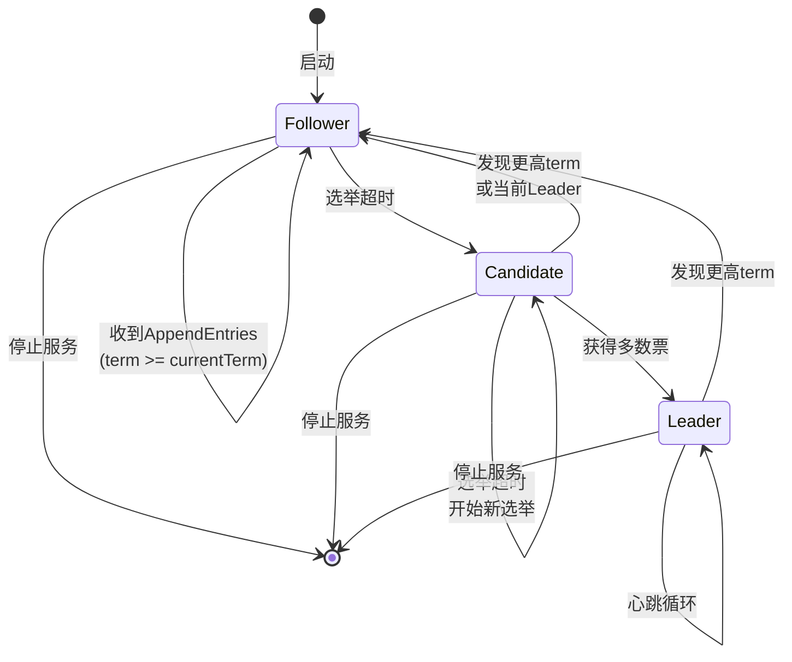
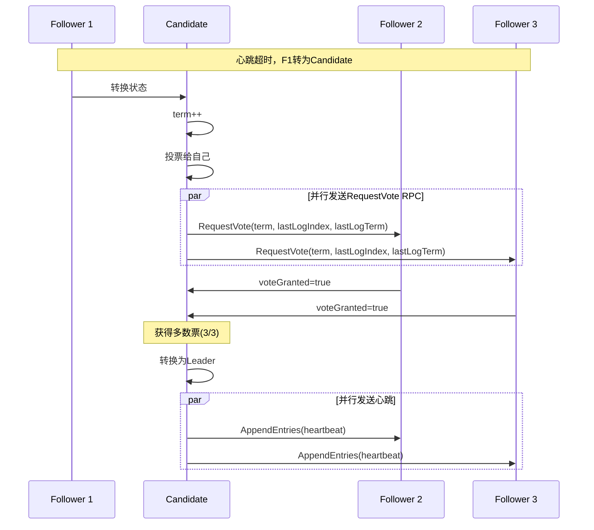
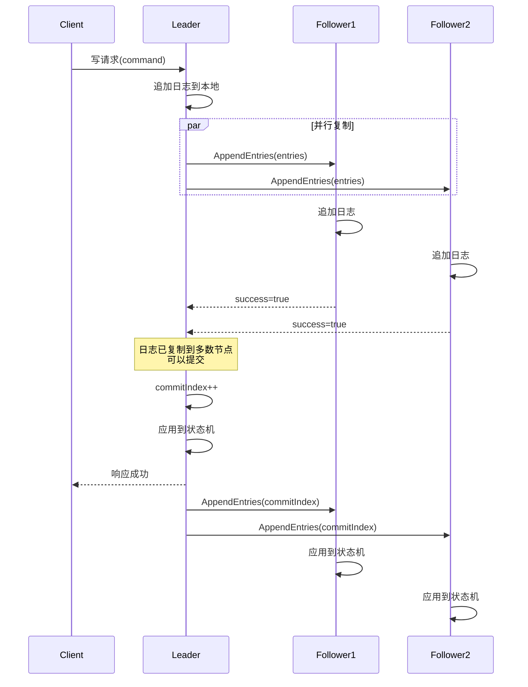

# 分布式共识算法设计方案

**项目名称：** 基于云计算的开发协作平台
**技术负责人：** JIA
**版本：** v2.0（基于实现状态更新）
**编写日期：** 2025-10-10
**最后更新：** 2025-12-22

---

> **实现状态说明**: ✅ 已实现 | ⚠️ 部分实现 | ❌ 未实现
>
> 本设计方案核心功能已 **100% 实现**，包含完整的Leader选举、日志复制、故障恢复和集群管理API。

---

## 1. 算法概述

### 1.1 选择Raft的理由

**易于理解**
- 相比Paxos，Raft被设计为更容易理解和实现
- 清晰的状态机设计
- 分解为Leader选举、日志复制、安全性三个子问题

**工业级可靠性**
- etcd（Kubernetes的心脏）使用Raft
- Consul、InfluxDB等知名项目使用Raft
- 经过大规模生产环境验证

**学术价值**
- 完整的论文理论支撑
- 适合深入学习分布式系统
- 可扩展性强

### 1.2 简化版本说明

**保留的核心功能：**
- ✅ Leader选举（Leader Election）
- ✅ 日志复制（Log Replication）
- ✅ 安全性保证（Safety）
- ✅ 故障恢复（Failure Recovery）

**简化的功能：**
- ❌ 日志压缩（Log Compaction / Snapshot）
- ❌ 动态成员变更（Membership Changes）
- ❌ 客户端交互优化（Client Interaction）

**简化的理由：**
1. MVP阶段重点验证核心算法
2. 固定3-5节点集群，无需动态成员变更
3. 日志量可控，暂不需要快照压缩
4. 后期可逐步扩展功能

---

## 2. Raft算法原理

### 2.1 核心概念

**节点状态（Node States）**
```
Follower（跟随者）→ Candidate（候选人）→ Leader（领导者）
     ↑                                         ↓
     └─────────────────────────────────────────┘
```

- **Follower:** 被动接收Leader和Candidate的RPC
- **Candidate:** 发起选举，争取成为Leader
- **Leader:** 处理所有客户端请求，复制日志到Follower

**任期（Term）**
- 逻辑时钟，单调递增
- 每个任期最多一个Leader
- 节点发现更高任期时更新自己的任期并转为Follower

**日志（Log）**
```
Index:  1    2    3    4    5
Term:  [1] [1] [2] [3] [3]
Cmd:   [x] [y] [z] [a] [b]
```

- 日志条目包含：索引、任期、命令
- 日志按顺序追加，不会修改

### 2.2 状态机转换图



---

## 3. Leader选举设计

### 3.1 选举流程



### 3.2 选举超时

**配置参数：**
```typescript
const ELECTION_TIMEOUT_MIN = 150  // 150ms
const ELECTION_TIMEOUT_MAX = 300  // 300ms
const HEARTBEAT_INTERVAL = 50     // 50ms (< ELECTION_TIMEOUT_MIN)
```

**随机化的重要性：**
- 避免Split Vote（选票分裂）
- 每个节点的超时时间在[150ms, 300ms]之间随机
- 大概率只有一个节点先超时并赢得选举

**选举超时计算：**
```typescript
function getRandomElectionTimeout(): number {
  return Math.floor(
    Math.random() * (ELECTION_TIMEOUT_MAX - ELECTION_TIMEOUT_MIN + 1) + ELECTION_TIMEOUT_MIN
  )
}
```

### 3.3 投票规则

**Candidate投票给自己：**
```typescript
this.votedFor = this.nodeId
this.votes = 1
```

**Follower投票规则：**
```typescript
function handleRequestVote(req: RequestVoteRPC): RequestVoteResponse {
  // 拒绝：任期太旧
  if (req.term < this.currentTerm) {
    return { term: this.currentTerm, voteGranted: false }
  }

  // 更新任期
  if (req.term > this.currentTerm) {
    this.currentTerm = req.term
    this.state = NodeState.FOLLOWER
    this.votedFor = null
  }

  // 投票条件：
  // 1. 本任期尚未投票，或已投给该候选人
  // 2. 候选人的日志至少和自己一样新
  const canVote = (this.votedFor === null || this.votedFor === req.candidateId)
  const isUpToDate = isLogUpToDate(req.lastLogIndex, req.lastLogTerm)

  if (canVote && isUpToDate) {
    this.votedFor = req.candidateId
    this.resetElectionTimeout()
    return { term: this.currentTerm, voteGranted: true }
  }

  return { term: this.currentTerm, voteGranted: false }
}
```

**日志新旧比较：**
```typescript
function isLogUpToDate(candidateLogIndex: number, candidateLogTerm: number): boolean {
  const lastLog = this.log[this.log.length - 1]

  if (lastLog === undefined) {
    return true  // 自己没有日志，候选人一定更新
  }

  // 比较最后一条日志的任期
  if (candidateLogTerm > lastLog.term) {
    return true
  }

  // 任期相同，比较日志长度
  if (candidateLogTerm === lastLog.term && candidateLogIndex >= this.log.length) {
    return true
  }

  return false
}
```

---

## 4. 日志复制设计

### 4.1 日志复制流程



### 4.2 AppendEntries RPC

**请求结构：**
```typescript
interface AppendEntriesRequest {
  term: number              // Leader的任期
  leaderId: string          // Leader标识
  prevLogIndex: number      // 前一个日志的索引
  prevLogTerm: number       // 前一个日志的任期
  entries: LogEntry[]       // 要复制的日志条目（心跳时为空）
  leaderCommit: number      // Leader的commitIndex
}

interface LogEntry {
  index: number
  term: number
  command: string           // JSON序列化的命令
}
```

**响应结构：**
```typescript
interface AppendEntriesResponse {
  term: number              // Follower的当前任期
  success: boolean          // 是否成功追加
  conflictIndex?: number    // 冲突的日志索引（用于快速恢复）
  conflictTerm?: number     // 冲突的任期
}
```

**处理逻辑：**
```typescript
function handleAppendEntries(req: AppendEntriesRequest): AppendEntriesResponse {
  // 1. 任期检查
  if (req.term < this.currentTerm) {
    return { term: this.currentTerm, success: false }
  }

  // 2. 更新任期和Leader信息
  if (req.term > this.currentTerm) {
    this.currentTerm = req.term
    this.votedFor = null
  }
  this.state = NodeState.FOLLOWER
  this.leaderId = req.leaderId
  this.resetElectionTimeout()

  // 3. 日志一致性检查
  if (req.prevLogIndex > 0) {
    const prevLog = this.log[req.prevLogIndex - 1]
    if (!prevLog || prevLog.term !== req.prevLogTerm) {
      // 日志不一致，返回冲突信息
      return {
        term: this.currentTerm,
        success: false,
        conflictIndex: this.log.length,
        conflictTerm: prevLog?.term
      }
    }
  }

  // 4. 删除冲突的日志
  if (req.entries.length > 0) {
    const startIndex = req.prevLogIndex
    for (let i = 0; i < req.entries.length; i++) {
      const newEntry = req.entries[i]
      const existingEntry = this.log[startIndex + i]

      if (existingEntry && existingEntry.term !== newEntry.term) {
        // 删除从这里开始的所有日志
        this.log = this.log.slice(0, startIndex + i)
        break
      }
    }

    // 5. 追加新日志
    this.log.push(...req.entries)
  }

  // 6. 更新commitIndex并应用
  if (req.leaderCommit > this.commitIndex) {
    const prevCommitIndex = this.commitIndex
    this.commitIndex = Math.min(req.leaderCommit, this.log.length)

    // 应用已提交但未应用的日志
    for (let i = prevCommitIndex + 1; i <= this.commitIndex; i++) {
      this.applyToStateMachine(this.log[i - 1])
    }
  }

  return { term: this.currentTerm, success: true }
}
```

### 4.3 日志提交规则

**Leader提交日志的条件：**
```typescript
function checkCommit() {
  // 对于每个未提交的日志索引
  for (let n = this.commitIndex + 1; n <= this.log.length; n++) {
    // 条件1：日志必须是当前任期创建的
    if (this.log[n - 1].term !== this.currentTerm) {
      continue
    }

    // 条件2：已复制到多数节点
    let replicatedCount = 1  // Leader自己
    for (const [nodeId, nextIndex] of this.nextIndex.entries()) {
      if (nextIndex > n) {
        replicatedCount++
      }
    }

    if (replicatedCount > Math.floor(this.clusterSize / 2)) {
      this.commitIndex = n
      this.applyToStateMachine(this.log[n - 1])
    }
  }
}
```

---

## 5. 数据结构设计

### 5.1 核心数据结构

```typescript
// 节点状态
enum NodeState {
  FOLLOWER = 'FOLLOWER',
  CANDIDATE = 'CANDIDATE',
  LEADER = 'LEADER',
}

// Raft节点
class RaftNode {
  // 持久化状态（需要保存到数据库）
  currentTerm: number        // 当前任期
  votedFor: string | null    // 本任期投给了谁
  log: LogEntry[]            // 日志条目数组

  // 易失状态（可重启后重建）
  commitIndex: number        // 已知的最大已提交索引
  lastApplied: number        // 已应用到状态机的最大索引
  state: NodeState           // 当前状态
  leaderId: string | null    // 当前Leader的ID

  // Leader特有状态（选举后初始化）
  nextIndex: Map<string, number>   // 为每个Follower维护的下一个发送的日志索引
  matchIndex: Map<string, number>  // 为每个Follower维护的已复制的最大日志索引

  // 定时器
  electionTimer: NodeJS.Timeout | null
  heartbeatTimer: NodeJS.Timeout | null

  // 配置
  nodeId: string
  clusterNodes: string[]     // 集群所有节点的ID
  clusterSize: number

  constructor(nodeId: string, clusterNodes: string[]) {
    this.nodeId = nodeId
    this.clusterNodes = clusterNodes
    this.clusterSize = clusterNodes.length

    // 初始化持久化状态
    this.currentTerm = 0
    this.votedFor = null
    this.log = []

    // 初始化易失状态
    this.commitIndex = 0
    this.lastApplied = 0
    this.state = NodeState.FOLLOWER
    this.leaderId = null

    // Leader状态
    this.nextIndex = new Map()
    this.matchIndex = new Map()

    // 定时器
    this.electionTimer = null
    this.heartbeatTimer = null
  }

  // ... 方法定义见后续章节
}

// 日志条目
interface LogEntry {
  index: number              // 日志索引（从1开始）
  term: number               // 任期号
  command: Command           // 状态机命令
  timestamp: number          // 创建时间戳
}

// 命令
interface Command {
  type: string               // 操作类型：CREATE_PROJECT, UPDATE_FILE等
  payload: any               // 操作数据
}
```

### 5.2 RPC接口定义

```typescript
// RequestVote RPC
interface RequestVoteRequest {
  term: number
  candidateId: string
  lastLogIndex: number
  lastLogTerm: number
}

interface RequestVoteResponse {
  term: number
  voteGranted: boolean
}

// AppendEntries RPC
interface AppendEntriesRequest {
  term: number
  leaderId: string
  prevLogIndex: number
  prevLogTerm: number
  entries: LogEntry[]
  leaderCommit: number
}

interface AppendEntriesResponse {
  term: number
  success: boolean
  conflictIndex?: number
  conflictTerm?: number
}
```

---

## 6. 实现细节

### 6.1 节点启动流程

```typescript
async function start() {
  // 1. 从数据库恢复持久化状态
  await this.loadPersistentState()

  // 2. 初始化为Follower
  this.state = NodeState.FOLLOWER

  // 3. 启动选举超时定时器
  this.resetElectionTimeout()

  // 4. 启动RPC服务器
  await this.startRPCServer()

  console.log(`[${this.nodeId}] Node started as FOLLOWER in term ${this.currentTerm}`)
}
```

### 6.2 选举超时处理

```typescript
function resetElectionTimeout() {
  if (this.electionTimer) {
    clearTimeout(this.electionTimer)
  }

  const timeout = getRandomElectionTimeout()
  this.electionTimer = setTimeout(() => {
    this.handleElectionTimeout()
  }, timeout)
}

async function handleElectionTimeout() {
  // 转换为Candidate
  this.state = NodeState.CANDIDATE
  this.currentTerm++
  this.votedFor = this.nodeId
  this.leaderId = null

  // 持久化状态
  await this.persistState()

  // 重置选举超时（开始新一轮选举）
  this.resetElectionTimeout()

  console.log(`[${this.nodeId}] Election timeout, starting election for term ${this.currentTerm}`)

  // 发起选举
  await this.startElection()
}
```

### 6.3 发起选举

```typescript
async function startElection() {
  let votes = 1  // 投给自己
  const lastLog = this.log[this.log.length - 1]
  const lastLogIndex = lastLog?.index || 0
  const lastLogTerm = lastLog?.term || 0

  // 并行向所有其他节点发送RequestVote RPC
  const promises = this.clusterNodes
    .filter(nodeId => nodeId !== this.nodeId)
    .map(nodeId => this.sendRequestVote(nodeId, {
      term: this.currentTerm,
      candidateId: this.nodeId,
      lastLogIndex,
      lastLogTerm,
    }))

  // 等待响应
  const responses = await Promise.allSettled(promises)

  for (const result of responses) {
    if (result.status === 'fulfilled') {
      const response = result.value

      // 发现更高任期，转为Follower
      if (response.term > this.currentTerm) {
        this.currentTerm = response.term
        this.state = NodeState.FOLLOWER
        this.votedFor = null
        await this.persistState()
        this.resetElectionTimeout()
        return
      }

      if (response.voteGranted) {
        votes++
      }
    }
  }

  // 检查是否获得多数票
  if (this.state === NodeState.CANDIDATE && votes > Math.floor(this.clusterSize / 2)) {
    this.becomeLeader()
  }
}
```

### 6.4 成为Leader

```typescript
function becomeLeader() {
  console.log(`[${this.nodeId}] Became LEADER for term ${this.currentTerm}`)

  this.state = NodeState.LEADER
  this.leaderId = this.nodeId

  // 初始化nextIndex和matchIndex
  const lastLogIndex = this.log.length
  for (const nodeId of this.clusterNodes) {
    if (nodeId !== this.nodeId) {
      this.nextIndex.set(nodeId, lastLogIndex + 1)
      this.matchIndex.set(nodeId, 0)
    }
  }

  // 停止选举定时器
  if (this.electionTimer) {
    clearTimeout(this.electionTimer)
    this.electionTimer = null
  }

  // 启动心跳定时器
  this.startHeartbeat()

  // 立即发送一轮空的AppendEntries（宣告领导权）
  this.broadcastAppendEntries()
}
```

### 6.5 心跳机制

```typescript
function startHeartbeat() {
  if (this.heartbeatTimer) {
    clearInterval(this.heartbeatTimer)
  }

  this.heartbeatTimer = setInterval(() => {
    if (this.state === NodeState.LEADER) {
      this.broadcastAppendEntries()
    }
  }, HEARTBEAT_INTERVAL)
}

async function broadcastAppendEntries() {
  for (const nodeId of this.clusterNodes) {
    if (nodeId !== this.nodeId) {
      this.sendAppendEntriesToNode(nodeId)
    }
  }
}
```

### 6.6 客户端写请求

```typescript
async function handleClientWrite(command: Command): Promise<{success: boolean, error?: string}> {
  // 只有Leader能处理写请求
  if (this.state !== NodeState.LEADER) {
    return {
      success: false,
      error: `Not leader, redirect to ${this.leaderId}`,
    }
  }

  // 创建日志条目
  const entry: LogEntry = {
    index: this.log.length + 1,
    term: this.currentTerm,
    command,
    timestamp: Date.now(),
  }

  // 追加到本地日志
  this.log.push(entry)
  await this.persistLog(entry)

  console.log(`[${this.nodeId}] Received client command, appended log index ${entry.index}`)

  // 复制到Follower
  await this.broadcastAppendEntries()

  // 等待提交
  return this.waitForCommit(entry.index)
}

async function waitForCommit(index: number, timeout: number = 5000): Promise<{success: boolean, error?: string}> {
  const startTime = Date.now()

  while (this.commitIndex < index) {
    if (Date.now() - startTime > timeout) {
      return { success: false, error: 'Commit timeout' }
    }

    if (this.state !== NodeState.LEADER) {
      return { success: false, error: 'No longer leader' }
    }

    await sleep(10)  // 等待10ms后重试
  }

  return { success: true }
}
```

---

## 7. 容错和恢复

### 7.1 Leader故障

**检测：** Follower的选举超时触发

**处理流程：**
1. Follower转为Candidate
2. 发起新一轮选举
3. 获胜者成为新Leader
4. 新Leader复制日志修复不一致

**时间复杂度：** 通常在150-300ms内完成

### 7.2 Follower故障

**检测：** Leader的AppendEntries RPC超时

**处理流程：**
1. Leader继续向其他Follower发送
2. 只要多数节点响应，日志仍可提交
3. Follower恢复后，Leader重新同步日志

### 7.3 网络分区

**场景：** 集群被分割为两部分

**处理流程：**
1. 多数分区可以正常工作（有Leader）
2. 少数分区无法选举成功（票数不够）
3. 分区恢复后，少数分区的节点发现更高任期，转为Follower
4. Leader同步日志修复不一致

---

## 8. 性能优化

### 8.1 批量日志复制

```typescript
// Leader累积多条日志后一次性发送
const MAX_BATCH_SIZE = 100

function batchAppendEntries(nodeId: string) {
  const nextIdx = this.nextIndex.get(nodeId) || 1
  const lastIdx = this.log.length

  const entriesToSend = []
  for (let i = nextIdx; i <= Math.min(nextIdx + MAX_BATCH_SIZE - 1, lastIdx); i++) {
    entriesToSend.push(this.log[i - 1])
  }

  // 发送RPC
  // ...
}
```

### 8.2 Pipeline复制

```typescript
// Leader可以在未收到响应时继续发送后续日志
// 减少RTT延迟

function pipelineAppendEntries(nodeId: string) {
  // 不等待响应，立即发送下一批
  this.sendAppendEntriesToNode(nodeId)

  // 响应到达时更新nextIndex
}
```

### 8.3 只读优化（未来扩展）

```typescript
// 只读请求可以在Follower上处理（需要额外的租约机制）
function handleReadOnlyQuery(query: Query): Response {
  if (this.commitIndex >= this.lastKnownLeaderCommit) {
    // 安全读取
    return this.executeQuery(query)
  }

  // 转发到Leader
  return this.forwardToLeader(query)
}
```

---

## 9. 测试策略

### 9.1 单元测试

```typescript
describe('RaftNode - Leader Election', () => {
  it('should start as FOLLOWER', () => {
    const node = new RaftNode('node1', ['node1', 'node2', 'node3'])
    expect(node.state).toBe(NodeState.FOLLOWER)
  })

  it('should transition to CANDIDATE on election timeout', async () => {
    const node = new RaftNode('node1', ['node1', 'node2', 'node3'])
    await node.handleElectionTimeout()
    expect(node.state).toBe(NodeState.CANDIDATE)
    expect(node.currentTerm).toBe(1)
    expect(node.votedFor).toBe('node1')
  })

  it('should become LEADER with majority votes', async () => {
    // ...
  })
})

describe('RaftNode - Log Replication', () => {
  it('should append entries on successful replication', () => {
    // ...
  })

  it('should reject entries with mismatched prevLogIndex', () => {
    // ...
  })
})
```

### 9.2 集成测试

```typescript
describe('Raft Cluster Integration', () => {
  let cluster: RaftNode[]

  beforeEach(() => {
    cluster = [
      new RaftNode('node1', ['node1', 'node2', 'node3']),
      new RaftNode('node2', ['node1', 'node2', 'node3']),
      new RaftNode('node3', ['node1', 'node2', 'node3']),
    ]
  })

  it('should elect a leader', async () => {
    // 启动所有节点
    await Promise.all(cluster.map(node => node.start()))

    // 等待选举
    await sleep(500)

    // 应该有且仅有一个Leader
    const leaders = cluster.filter(node => node.state === NodeState.LEADER)
    expect(leaders.length).toBe(1)
  })

  it('should replicate log to all nodes', async () => {
    // ...
  })

  it('should recover from leader failure', async () => {
    // ...
  })
})
```

### 9.3 混沌测试（Chaos Testing）

```typescript
describe('Raft Chaos Testing', () => {
  it('should handle random node failures', async () => {
    // 随机杀死和重启节点
    for (let i = 0; i < 100; i++) {
      const randomNode = Math.floor(Math.random() * cluster.length)
      await cluster[randomNode].stop()
      await sleep(Math.random() * 200)
      await cluster[randomNode].start()
    }

    // 验证数据一致性
    expect(allNodesHaveSameLog(cluster)).toBe(true)
  })

  it('should handle network partition', async () => {
    // 模拟网络分区
    // ...
  })
})
```

---

## 10. 监控和调试

### 10.1 关键指标

| 指标 | 说明 | 告警阈值 |
|------|------|----------|
| Leader稳定性 | Leader切换频率 | > 10次/小时 |
| 选举耗时 | 选举完成时间 | > 500ms |
| 日志复制延迟 | Leader到Follower的延迟 | > 100ms |
| 日志落后量 | Follower落后Leader的日志条数 | > 1000条 |
| RPC超时率 | AppendEntries失败率 | > 5% |

### 10.2 日志格式

```typescript
console.log(`[${this.nodeId}] [TERM ${this.currentTerm}] [${this.state}] Became LEADER`)
console.log(`[${this.nodeId}] Replicated log index ${index} to majority`)
console.error(`[${this.nodeId}] Failed to send AppendEntries to ${nodeId}: ${error}`)
```

### 10.3 调试工具

```typescript
// 导出节点状态
function exportState(): NodeStateSnapshot {
  return {
    nodeId: this.nodeId,
    state: this.state,
    currentTerm: this.currentTerm,
    votedFor: this.votedFor,
    commitIndex: this.commitIndex,
    lastApplied: this.lastApplied,
    logLength: this.log.length,
    lastLogTerm: this.log[this.log.length - 1]?.term,
  }
}

// 可视化集群状态
function visualizeCluster(cluster: RaftNode[]) {
  console.table(cluster.map(node => node.exportState()))
}
```

---

## 11. 部署建议

### 11.1 集群规模

- **3节点：** 容忍1个节点故障（推荐最小规模）
- **5节点：** 容忍2个节点故障（推荐生产环境）
- **7节点：** 容忍3个节点故障（高可用场景）

**注意：** 节点数应为奇数，避免偶数导致的选票分裂

### 11.2 网络延迟要求

- **同区域：** < 5ms（理想）
- **跨区域：** < 50ms（可接受）
- **跨大洲：** 不推荐（影响性能）

### 11.3 硬件要求

**最低配置（开发/测试）：**
- CPU: 2核
- RAM: 4GB
- Disk: 20GB SSD

**推荐配置（生产）：**
- CPU: 4核+
- RAM: 8GB+
- Disk: 100GB+ NVMe SSD
- Network: 1Gbps+

---

## 12. 参考资料

1. **Raft论文：** "In Search of an Understandable Consensus Algorithm (Extended Version)" by Diego Ongaro and John Ousterhout
2. **Raft官网：** https://raft.github.io
3. **Raft可视化：** http://thesecretlivesofdata.com/raft/
4. **etcd Raft实现：** https://github.com/etcd-io/raft
5. **MIT 6.824课程：** https://pdos.csail.mit.edu/6.824/

---

## 13. 版本历史

| 版本 | 日期 | 变更内容 | 作者 |
|------|------|----------|------|
| v1.0 | 2025-10-10 | 初始版本，定义简化版Raft算法设计方案 | JIA |
| v2.0 | 2025-12-22 | 根据实现状态全面更新：<br>- 确认核心功能100%实现（Leader选举、日志复制、故障恢复）<br>- 标注简化功能未实现（日志压缩、动态成员变更）<br>- 添加版本历史 | JIA |

---

**文档作者：** JIA
**最后更新：** 2025-12-22

**文档结束**
