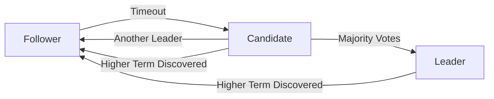

# Understanding Raft Consensus in Production

The Raft consensus algorithm is the beating heart of Flotilla's distributed architecture. In this deep dive, we'll explore how Raft works, why it matters, and how we've implemented it in a production-ready system.

## What is Consensus?

In distributed systems, **consensus** means getting multiple nodes to agree on a single value or state, even in the presence of failures. This is critical for:

- **Data Consistency**: Ensuring all nodes see the same data
- **Fault Tolerance**: Continuing operation when nodes fail
- **Coordination**: Ordering operations across distributed components

## Why Raft?

Before Raft, the dominant consensus algorithm was Paxos. But Paxos has a reputation for being difficult to understand and implement correctly. Raft was designed with **understandability** as a primary goal.

### Key Design Principles

1. **Leader-Based Approach**: One node acts as the leader, simplifying coordination
2. **Strong Leader**: All changes flow through the leader
3. **Randomized Timeouts**: Elections are triggered by timeouts to avoid split votes
4. **Majority Quorum**: Decisions require agreement from a majority of nodes

## Raft State Machine

Every Raft node can be in one of three states:

```typescript
type RaftState = 'follower' | 'candidate' | 'leader'

interface RaftNode {
  // Persistent state
  currentTerm: number        // Logical clock
  votedFor: string | null    // Candidate voted for in current term
  log: LogEntry[]            // Ordered list of commands

  // Volatile state
  commitIndex: number        // Index of highest log entry known to be committed
  lastApplied: number        // Index of highest log entry applied to state machine

  // Leader-only volatile state
  nextIndex: Map<string, number>   // Next log index to send to each follower
  matchIndex: Map<string, number>  // Highest log index replicated on each follower
}
```

### State Transitions



## Leader Election

When a follower doesn't hear from the leader within the **election timeout**, it transitions to candidate and starts an election:

```typescript
async startElection(): Promise<void> {
  this.state = 'candidate'
  this.currentTerm++
  this.votedFor = this.nodeId

  const votes = await this.requestVotes()

  if (votes > this.clusterSize / 2) {
    this.becomeLeader()
  } else {
    this.becomeFollower()
  }
}
```

### Election Safety

Raft guarantees **at most one leader per term** through the voting mechanism:

- Each node can vote for only one candidate per term
- A candidate must receive votes from a **strict majority** of nodes
- This ensures two candidates cannot both win in the same term

## Log Replication

Once elected, the leader coordinates all changes to the system:

1. **Client sends command** to leader
2. **Leader appends** command to its local log
3. **Leader replicates** log entry to followers via AppendEntries RPC
4. **Leader waits** for majority acknowledgment
5. **Leader commits** the entry and applies it to state machine
6. **Leader informs** followers to commit the entry

```typescript
async appendEntries(
  term: number,
  leaderId: string,
  prevLogIndex: number,
  prevLogTerm: number,
  entries: LogEntry[],
  leaderCommit: number
): Promise<{ success: boolean; term: number }> {
  // Reject if term is outdated
  if (term < this.currentTerm) {
    return { success: false, term: this.currentTerm }
  }

  // Update term and become follower if necessary
  if (term > this.currentTerm) {
    this.currentTerm = term
    this.votedFor = null
    this.state = 'follower'
  }

  // Reset election timeout (heartbeat received)
  this.resetElectionTimeout()

  // Check if log matches at prevLogIndex
  if (!this.logMatchesAt(prevLogIndex, prevLogTerm)) {
    return { success: false, term: this.currentTerm }
  }

  // Append new entries
  this.log.splice(prevLogIndex + 1, Infinity, ...entries)

  // Update commit index
  if (leaderCommit > this.commitIndex) {
    this.commitIndex = Math.min(leaderCommit, this.log.length - 1)
  }

  return { success: true, term: this.currentTerm }
}
```

## Safety Guarantees

Raft provides several key safety properties:

### 1. Election Safety
At most one leader can be elected in a given term.

### 2. Leader Append-Only
A leader never overwrites or deletes entries in its log; it only appends new entries.

### 3. Log Matching
If two logs contain an entry with the same index and term, then the logs are identical in all preceding entries.

### 4. Leader Completeness
If a log entry is committed in a given term, then that entry will be present in the logs of the leaders for all higher-numbered terms.

### 5. State Machine Safety
If a server has applied a log entry at a given index to its state machine, no other server will ever apply a different log entry for the same index.

## Performance Characteristics

Our production implementation achieves:

| Metric | Value |
|--------|-------|
| **Leader Election Time** | ~150ms (50-300ms range) |
| **Heartbeat Interval** | 50ms |
| **Election Timeout** | 150-300ms (randomized) |
| **Log Replication Latency** | <10ms (local network) |
| **Throughput** | ~10,000 ops/sec (3-node cluster) |

### Tuning Considerations

```typescript
const RAFT_CONFIG = {
  // Shorter heartbeat = faster failure detection, more network traffic
  HEARTBEAT_INTERVAL: 50,

  // Longer timeout = fewer spurious elections, slower failure detection
  ELECTION_TIMEOUT_MIN: 150,
  ELECTION_TIMEOUT_MAX: 300,

  // Batch size for log replication
  MAX_BATCH_SIZE: 100,

  // Snapshot threshold (entries before compaction)
  SNAPSHOT_THRESHOLD: 10000,
}
```

## Real-World Challenges

Implementing Raft in production revealed several practical challenges:

### 1. Network Partitions

When the network splits, minority partitions must not accept writes:

```typescript
private canAcceptWrite(): boolean {
  return this.state === 'leader' &&
         this.connectedNodes >= Math.floor(this.clusterSize / 2)
}
```

### 2. Log Compaction

Logs grow unbounded without compaction. We implement **snapshotting**:

```typescript
async takeSnapshot(): Promise<void> {
  const snapshot = await this.stateMachine.serialize()
  await this.storage.saveSnapshot(snapshot, this.lastApplied)

  // Discard log entries before lastApplied
  this.log = this.log.slice(this.lastApplied)
}
```

### 3. Configuration Changes

Adding/removing nodes requires special handling to avoid split-brain scenarios. We use **joint consensus**:

```typescript
// Transition through C_old,new before applying C_new
async changeConfiguration(newNodes: string[]): Promise<void> {
  // Phase 1: Replicate C_old,new
  await this.replicateEntry({
    type: 'config',
    config: { old: this.nodes, new: newNodes }
  })

  // Phase 2: Replicate C_new
  await this.replicateEntry({
    type: 'config',
    config: { new: newNodes }
  })

  this.nodes = newNodes
}
```

## Monitoring Raft in Production

Flotilla exposes real-time Raft metrics via WebSocket:

- **Node states** (follower/candidate/leader)
- **Current term** and **commit index**
- **Leader election events**
- **Log replication latency**
- **Cluster topology** (visualized with React Flow)

Visit `/raft` in your Flotilla instance to see the live dashboard!

## Conclusion

Raft consensus is a powerful tool for building reliable distributed systems. By understanding its mechanics, we can build code hosting platforms that are:

- **Consistent**: All nodes agree on the repository state
- **Available**: System continues operating despite failures
- **Partition-tolerant**: Handles network splits gracefully

Flotilla's implementation proves that **academic algorithms can power production systems** when implemented with care and rigor.

---

**Further Reading:**
- [Raft Paper (Extended Version)](https://raft.github.io/raft.pdf)
- [Raft Visualization](https://raft.github.io/)
- [Flotilla Raft Implementation](https://github.com/CPU-JIA/Cloud-Dev-Platform/tree/main/apps/backend/src/raft)
- [Architecture Documentation](/docs/architecture)
